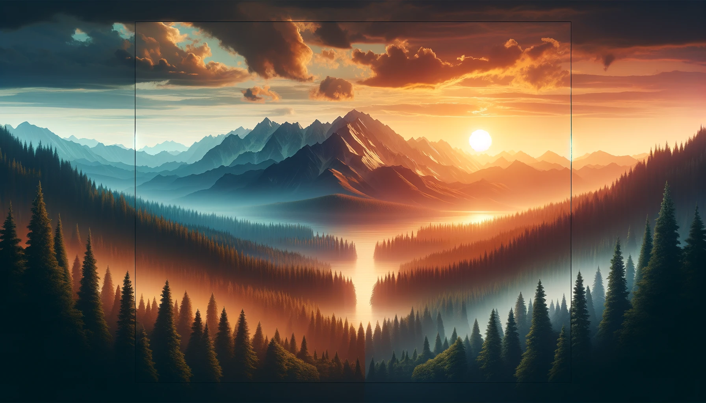

# PromptJSON Documentation

## Overview
PromptJSON is a JSON-based language designed for crafting structured prompts for image generation models. It offers a standardized way to specify image details, enhancing compatibility and image quality.

NOTE: This is primarily intended as a thought experiment, but if it is useful to you feel free to use or submit PRs.

## Schema Details

### Image
The root object of PromptJSON that contains all the details for generating an image.

#### version
- **Type**: String
- **Description**: Version of the PromptJSON schema.
- **Required**: Yes

#### Prompts
- **Type**: Array
- **Description**: An array of objects that describe individual image prompts, each with a "Prompt" and optional "Attributes".
- **Required**: Yes

##### Prompt
- **Type**: String
- **Description**: String describing the scene and subjects, optionally with weights.
- **Pattern**: "^(.*?)(::\\d+)?$"
- **Required**: Yes

##### Attributes
- **Type**: Object
- **Description**: Artistic attributes of the image, including additional optional settings for nuanced control.
- **Properties**:
  - **Style**: String for artistic style.
  - **Mood**: String for mood of the image.
  - **ColorScheme**: String for primary colors.
- **AdditionalProperties**: True

#### AspectRatio
- **Type**: String
- **Description**: String for aspect ratio (e.g., '16:9').
- **Required**: No

#### Style
- **Type**: String
- **Description**: Overall style of the image.
- **Required**: No

#### Dimensions
- **Type**: String
- **Description**: Specific dimensions for the image.
- **Required**: No

## Examples

### Example 1: Simple Landscape
```json
{
  "Image": {
    "version": "6.0",
    "Prompts": [
      {
        "Prompt": "A tranquil mountain range at sunset",
        "Attributes": {
          "Style": "realistic",
          "Mood": "peaceful",
          "ColorScheme": "warm colors"
        }
      }
    ],
    "Dimensions": "1920x1080"
  }
}
```


### Example 2: Portrait of a Person
```json
{
  "Image": {
    "version": "1.0",
    "Prompts": [
      {
        "Prompt": "Elegant portrait of a person in a Victorian setting",
        "Attributes": {
          "Style": "classical painting",
          "Mood": "sophisticated",
          "ColorScheme": "rich, muted colors"
        },
        "Options": {
          "PersonDetails": {
            "Gender": "female",
            "Age": "early 30s",
            "Clothing": "Victorian dress",
            "Expression": "thoughtful"
          },
          "Lighting": "soft, from the left"
        }
      }
    ],
    "AspectRatio": "4:5"
  }
}
```


## Usage
To validate a PromptJSON file, run the `promptscript_validator.py` script with the JSON file as an argument:
```bash
python promptscript_validator.py <file_to_validate.json>
```
Ensure that your PromptJSON file adheres to the schema and is correctly formatted before using it as input for your image generation model.

---